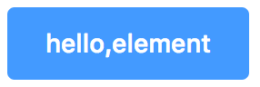
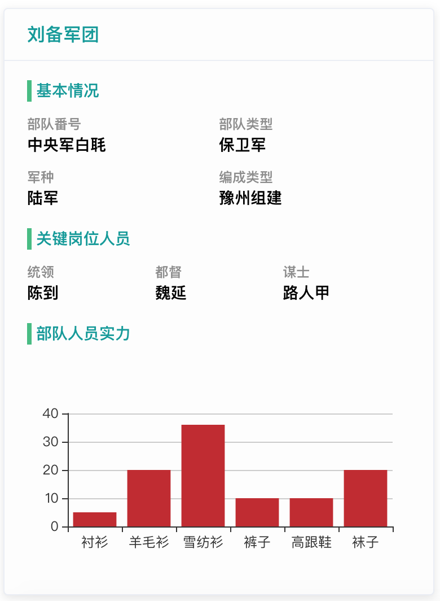
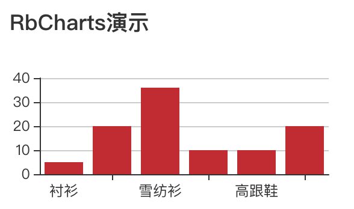
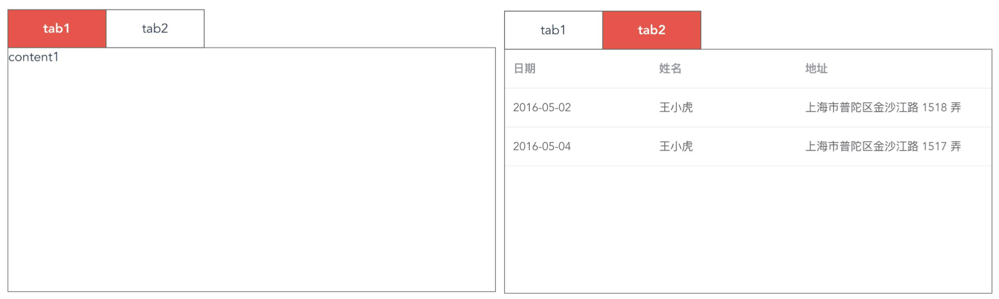

<!-- TOC -->

- [rb-lib](#rb-lib)
    - [安装使用](#安装使用)
    - [组件](#组件)
        - [1、hello测试](#1hello测试)
        - [2、插槽布局](#2插槽布局)
            - [优点](#优点)
        - [3、图表(基于echarts)](#3图表基于echarts)
        - [4、树(基于jq的ztree)](#4树基于jq的ztree)
        - [5、标签页](#5标签页)

<!-- /TOC -->
# rb-lib

> 一个基于element-ui的二次开发库，需要依赖element-ui库

## 安装使用

``` bash
# npm安装
npm install rb-lib --save-dev

# 完整引入
import ElementUI from 'element-ui';
import 'element-ui/lib/theme-chalk/index.css';
Vue.use(ElementUI);
import RbLib from 'rb-lib'
Vue.use(RbLib)
```

## 组件
#### 1、hello测试
> 例子
```
<template>
    <div id="app">
        <rb-hello-element></rb-hello-element>
    </div>
</template>
<script>
    export default {}
</script>
```

#### 2、插槽布局
> 例子1
```
<template>
    <rb-layout :layout-data="formData" :gutter="10">
        <template slot-scope="props">
            <div class="wrap">{{props.label}}</div>
        </template>
    </rb-layout>
</template>
<script>
    export default {
        name: "testLayout",
        data: function () {
            return {
                formData: [
                    {label: 'a', part: 3},
                    {label: 'b', part: 3},
                    {label: 'c', part: 3},
                    {label: 'd', part: 2},
                    {label: 'e', part: 2},
                ]
            }
        }
    }
</script>
<style>
    .wrap {
        color: white;
        background-color: gray;
        width: 100%;
        margin: 2px;
    }
</style>
```
</br>
> 例子2：和动态组件一起使用
###### 优点
+ 本组件对修改封闭：如果有新的子组件添加，则直接在main.js中进行全局注册，然后通过数据项的componentType属性匹配组件名，则动态使用该组件，无需在本组件中添加。
+ 本组件的内容由数据控制：如果添加/删除内容项，可以直接在数据中增删
```
<template>
    <div id="armyDetail">
        <el-card class="box-card">
            <div slot="header" class="clearfix">
                <span class="tip">{{tip}}</span>
            </div>
            <div v-for="item in slotData">
                <div style="margin-top:15px;">
                    <span class="item-title">{{item.title}}</span>
                </div>
                <rb-layout :layout-data="item.content">
                    <template slot-scope="props">
                      <component :is="props.componentType" :scope="props"></component>
                    </template>
                </rb-layout>
            </div>
        </el-card>
    </div>
</template>
<script>
    import {slotData} from './layout/layoutData'
    export default {
        data: function () {
            return {
                tip: '刘备军团',
                slotData:slotData
            }
        }
    }
</script>
```
</br>
#### 3、图表(基于echarts) ####
> 本组件基于echarts，所以使用前需要安装.
+ 安装
```
npm install echarts -S
```
+ main.js中全局引入
```
import echarts from 'echarts'
Vue.prototype.$echarts = echarts
```
> 例子
```
<template>
    <rb-charts chartsId="chartsId" :height="200" :width="300" :options="options"></rb-charts>
</template>
<script>
    export default {
        data() {
            return {
                options: {
                    title: {text: 'RbCharts演示'},
                    tooltip: {},
                    xAxis: {
                        data: ["衬衫", "羊毛衫", "雪纺衫", "裤子", "高跟鞋", "袜子"]
                    },
                    yAxis: {},
                    series: [
                        {
                            name: '销量',
                            type: 'bar',
                            data: [5, 20, 36, 10, 10, 20]
                        }
                    ]
                }
            }
        }
    }
</script>
```
</br>
#### 4、树(基于jq的ztree)
#### 5、标签页
> 属性

|参数  |说明  |类型 |可选值|默认值|
|:---:|:---:|:---:|:---:|:---:|
|list|数据接口的数组 |array|-|-|
|alive|是否使用keep-alive |boolean|true/false|false|


>数据接口

|属性  |说明 |类型  |
|:---:|:---:|:---:|
|title|标签页的名称 |string|
|type|内容组件的组件名 |string|
|content|内容组件的props的代理 |string/object|
> 例子
```
<template>
    <div>
        <rb-tabs :list="list">
        </rb-tabs>
    </div>
</template>
<script>
    export default {
        data: function () {
            return {
                list: [
                    {
                        title: 'tab1',
                        type: 'comp1',
                        content: 'content1'
                    },
                    {
                        title: 'tab2',
                        type: 'comp2',
                        content: {
                            tableData: [
                                {
                                    date: '2016-05-02',
                                    name: '王小虎',
                                    address: '上海市普陀区金沙江路 1518 弄'
                                }, {
                                    date: '2016-05-04',
                                    name: '王小虎',
                                    address: '上海市普陀区金沙江路 1517 弄'
                                }
                            ]
                        }
                    }
                ]
            }
        }
    }
</script>
```
```
//comp1.vue
<template>
    <div>{{content}}</div>
</template>
<script>
    export default {
        props: ['content']
    }
</script>
```
```
//comp2.vue
<template>
    <el-table
            :data="content.tableData"
            style="width: 100%">
        <el-table-column
                prop="date"
                label="日期"
                width="180">
        </el-table-column>
        <el-table-column
                prop="name"
                label="姓名"
                width="180">
        </el-table-column>
        <el-table-column
                prop="address"
                label="地址">
        </el-table-column>
    </el-table>
</template>
<script>
    export default {
        props: ['content']
    }
</script>
```
