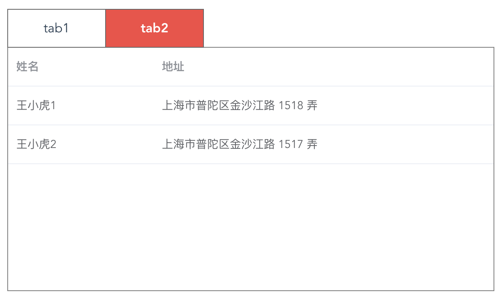

<!-- TOC -->

- [rb-lib](#rb-lib)
    - [指南](#指南)
        - [1、npm安装](#1npm安装)
        - [2、组件库引入](#2组件库引入)
        - [3、依赖导入](#3依赖导入)
    - [组件](#组件)
        - [1、图表(基于echarts)](#1图表基于echarts)
        - [2、树(基于jq的ztree)](#2树基于jq的ztree)
        - [3、标签页](#3标签页)
        - [4、经纬度显示](#4经纬度显示)
        - [5、动态表单](#5动态表单)
    - [测试和样例](#测试和样例)
    - [总结](#总结)

<!-- /TOC -->
# rb-lib

> 一个基于vue/elementUi的前端组件库

## 指南

#### 1、npm安装 ####
使用 npm 的方式安装，可以和 webpack 打包工具配合使用。
``` bash
npm install rb-lib --save-dev
```
#### 2、组件库引入 ####
在 main.js 中写入以下内容
``` bash
import ElementUI from 'element-ui';
import 'element-ui/lib/theme-chalk/index.css';
Vue.use(ElementUI);
import RbLib from 'rb-lib'
Vue.use(RbLib)
```
#### 3、依赖导入 ####
本组件库的图表/树组件依赖于echarts/ztree
``` bash
npm install --D echarts ztree
```
同时需要在webpack.dev.config.js中添加如下代码
``` bash
plugins: [
    new webpack.ProvidePlugin({
    jQuery: "jquery",
    $: "jquery"
})
```

## 组件

#### 1、图表(基于echarts) ####
> 通过vue组件的方式封装echarts，具体配置参见echarts官网

##### 示例 #####
```
<template>
    <rb-charts chartsId="chartsId"
               :options="options"></rb-charts>
</template>
<script>
    export default {
        data() {
            return {
                options: {
                    title: {text: 'RbCharts组件示例'},
                    tooltip: {},
                    xAxis: {
                        data: ["衬衫", "羊毛衫", "雪纺衫", "裤子", "高跟鞋", "袜子"]
                    },
                    yAxis: {},
                    series: [{
                        name: '销量',
                        type: 'bar',
                        data: [5, 20, 36, 10, 10, 20]
                    }]
                }
            }
        }
    }
</script>
```
</br>
##### Attributes #####
|参数  |说明  |类型 |可选值|默认值|
|:---:|:---:|:---:|:---:|:---:|
|chartsId|图表唯一标识 |string|-|必填|
|options|echarts的配置项|object|-|必填|
|width|图表宽度|number|-|400|
|height|图表高度|number|-|300|
#### 2、树(基于jq的ztree)
> 通过vue组件的方式封装ztree，具体配置参见ztree官网

##### 示例 #####
```
<template>
    <section class="testTree">
        <h4>RbTree组件示例</h4>
        <rb-tree ztreeID="ztreeID"
                 :ztreeData="ztreeData"></rb-tree>
    </section>
</template>
<script>
    export default {
        data: function () {
            return {
                ztreeData: [
                    {
                        name: 'a', children: [
                            {name: 'b'},
                            {name: 'c'}
                        ]
                    }
                ]
            }
        }
    }
</script>

```
</br>
##### Attributes #####
|参数  |说明  |类型 |可选值|默认值|
|:---:|:---:|:---:|:---:|:---:|
|ztreeID|ztree唯一标识 |string|-|必填|
|ztreeSetting|ztree配置 |object|-|-|
|ztreeData|ztree数据 |array|-|必填|
|isCollapse|是否展开 |boolean|true/false|false|
#### 3、标签页
> + 通过配置控制标签页，而不是代码
##### 使用场景 #####
当标签页中组件类似，且标签页数据较多时，el-tabs标签内代码多且相似，难以维护和调试
##### 示例 #####
```
//测试代码
<template>
    <div>
        <rb-tabs :list="list"></rb-tabs>
    </div>
</template>
<script>
    import Vue from 'vue';
    import comp1 from './comp1'
    import comp2 from './comp2'
    Vue.component(comp1.name, comp1)
    Vue.component(comp2.name, comp2)
    export default {
        data: function () {
            return {
                list: [
                    {
                        title: 'tab1',
                        type: 'comp1',
                        content: 'content1'
                    },
                    {
                        title: 'tab2',
                        type: 'comp2',
                        tableData: [
                            {
                                name: '王小虎1',
                                address: '上海市普陀区金沙江路 1518 弄'
                            }, {
                                name: '王小虎2',
                                address: '上海市普陀区金沙江路 1517 弄'
                            }
                        ]

                    }
                ]
            }
        }
    }
</script>
//组件1
<template>
    <div>{{content}}</div>
</template>
<script>
    export default {
        name: 'comp1',
        props: ['content']
    }
</script>
//组件2
<template>
    <el-table
            :data="currentTableData"
            style="width: 100%">
        <el-table-column
                prop="name"
                label="姓名"
                width="180">
        </el-table-column>
        <el-table-column
                prop="address"
                label="地址">
        </el-table-column>
    </el-table>
</template>
<script>
    export default {
        name: 'comp2',
        props: ['tableData'],
        data() {
            return {
                currentTableData: this.tableData
            }
        }
    }
</script>
```
</br>
##### Attributes #####
|参数  |说明  |类型 |可选值|默认值|
|:---:|:---:|:---:|:---:|:---:|
|list|各个组件配置和数据 |array|-|-|
|alive|是否使用keep-alive |boolean|true/false|false|
##### Item Attributes #####
|属性  |说明 |类型  |
|:---:|:---:|:---:|
|title|标签页的名称 |string|
|type|内容组件的组件名 |string|
|...|内容组件的props|string/object|
#### 4、经纬度显示 ####
> + 提供经纬度的显示和输入
> + 自动校验输入范围
> + 支持字符串和数值输入
##### 示例 #####
```
      <rb-position @input="handleValue"
                   :value="value"></rb-position>
```
</br>
##### Attributes #####
|参数  |说明  |类型 |可选值|默认值|
|:---:|:---:|:---:|:---:|:---:|
|value|经纬度的值，长度为2的数组 |Array|-|-|
|formatInput|输入格式 |string|string/number|number|
|formatOutput|输出格式 |string|string/number|number|
|disabled|是否可编辑 |boolean|true/false|false|
|part|经纬度部分显示 |string|jd/wd/jwd|jwd|
|hideHeader|隐藏标题头 |boolean|true/false|false|
|unitChn|单位使用中文 |boolean|true/false|false|

#### 5、动态表单 ####
> + 通过配置控制表单项，而不是代码
> + 基本表单的定义和动态表单组件解耦，可自行定义表单项
> + 支持整数范围验证
##### 使用场景 #####
录入对象信息时，当对象属性信息较多，且属性信息类型不一致，此时如果使用静态表单，则会出现很多相似代码，难以调试及维护
##### 示例 #####
```
//form-config.json
{
  "labelWidth": "100px",
  "labelPosition": "right",
  "formItemList": [
    {
      "type": "input",
      "name": "批号",
      "placeholder": "请输入1000-2000",
      "rules": [
        {
          "validator": "integerRange(1000,2000)"
        }
      ]
    },
    {
      "type": "select",
      "name": "属性",
      "placeholder": "请选择",
      "options": [
        "敌",
        "我",
        "不明"
      ],
      "rules": [
        {
          "required": true,
          "message": "不能为空",
          "trigger": "blur"
        }
      ]
    },
    {
      "name": "经度",
      "type": "position",
      "part": "jd",
      "hideHeader": true
    },
    {
      "name": "纬度",
      "type": "position",
      "part": "wd",
      "hideHeader": true
    },
    {
      "name": "时间",
      "type": "date-picker",
      "subtype": "datetime"
    },
    {
      "name": "颜色",
      "type": "color-picker"
    }
  ]
}
//form-value.json
{
  "批号": "1234",
  "属性": "敌",
  "经度": [
    0,
    0
  ],
  "纬度": [
    0,
    0
  ],
  "时间": "",
  "颜色": "#ff0000"
}
```
</br>
##### 自定义表单项目 #####
自定义或第三方的表单控件，也可以与动态表单组件一起使用。只要该组件遵循以下的约定：
> + 提供受控属性 value
> + 响应input事件
> + 组件名称为"el-xxx-adapter"形式

##### 表单布局 #####
每个表单项可以通过配置中添加span属性控制布局，底层实现为el-row/el-col，按照基础的 24 分栏，默认span=12
##### Attributes #####
|参数  |说明  |类型 |可选值|默认值|
|:---:|:---:|:---:|:---:|:---:|
|formConfig|动态表单配置 |object|-|必填|
|formValue|动态表单数据 |object|-|必填|
##### 参考 #####
+ 超级表单(https://github.com/bowencool/super-form)
## 测试和样例
> + 本项目没有采用krama/jasmine等测试框架，而是将所有的测试页面放在`src/component`中，用户可以启动工程自行测试   </br>
 </br>
 </br>
 </br>
## 总结
> + 本组件库主要是提取项目中公用的基本组件和业务组件，通过git或npm方式导入工程中，方便项目开发。
> + tree/charts组件将echarts/ztree两个功能强大的前端库整合到vue框架中，通过vue组件方式调用。
> + tabs/dynForm组件主要针对标签/表单项过多情况，单一组件太过复杂。首先将组件和具体业务解耦，再通过配置方式将所有具体项进行组合。符合开闭原则和单一原则。
> + 配置方式整合最核心是vue提供动态组件component，方便根据配置项中组件名和组件props直接生成组件，对比react中则较难实现(参见https://github.com/robin2017/react-dyn-form)